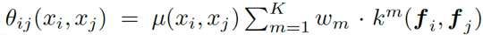

# 经典语义分割模型

## 任务定义

   与目标检测不同，语义分割任务不但要对图片中的物体的位置和类别进行预测，还要精确地描绘出不同类物体之间的边界（注意是不同类物体，而不是不同物体。若对同一类的不同物体也进行区分，则为实例分割（instance segmentation）。语义分割只考虑类别。）。因此，对图像的语义分割可以看成是对图像中的每个像素点的逐点分类。

图像语义分割相对于整图分类或者目标检测的一个重要的困难点在于：该任务一方面要求高层语义特征（正确分类），又要求轮廓尽可能贴合真实的边界（像素级别要对齐）。这两个要求实际上是相反的，语义层级高意味着整体、coarse，也就是不关注具体的像素细节，而关注整体的形态。而像素级别的轮廓则要求特征尽可能的fine-grained，即少关注高层语义，多关注边缘、细节这类low-level的特征。语义分割的优化，基本就是以解决此问题为最终目标，对模型进行改进。

## 语义分割的评估指标

l  pixel accuracy: 分类正确的像素点占总体的比例。相当于普通样本分类问题中的acc。

l  mean accuracy: 每个类别的分类的acc的平均值。类似目标检测中的mAP。

l  mean IU: 平均IoU，即每个类别的IoU的平均值，即mean IoU。

l  frequency weighted IU: 对mean IU进行加权，权重为该类别的比例，即FWIoU。

l  BF（Boundary F1-score）: 对所有的ground-truth和prediction的轮廓（contour）点进行比较，计算准确率和召回率，得到F1-score。注意，由于轮廓不会完全精准，因此这里的准确指的是在一定容忍范围内的相等（distance error tolerance），即prediction的轮廓上点与gt上点的距离小于某个阈值。（Reference : \[1\] Csurka, G., D. Larlus, and F. Perronnin. "What is a good evaluation measure for semantic segmentation?" Proceedings of the British Machine Vision Conference, 2013, pp. 32.1-32.11.）

## 经典模型

### FCN

> reference: Fully Convolutional Networks for Semantic Segmentation 
>
> Jonathan Long\_ Evan Shelhamer\_ Trevor Darrell UC Berkeley

FCN是第一个用分类CNN处理图像语义分割的模型。实际上，如果不考虑分类CNN的全连接层， 仅考虑conv和pool的话，最终生成的二维图形其实就是对应的每个位置（区域）的类别的heatmap，只不过在整图分类的任务中，这个heatmap中的信息被整合在一起了。关于CNN全连接层之前的feature map可以表示对应区域的预测结果这一结论，早在整图分类的某经典模型中就已经提出了，FCN处理语义分割就是沿用了这一思路。

FCN的基本网络结构如下：

  可以看出，FCN首先按照整图分类的方式，对原始图像进行卷积+下采样，直到某个较高的层次（小尺寸feature map），此时网络已经提取了各个位置的高层语义信息。然后，将最后这个含有语义信息的feature map上采样到原图的大小，然后加上一个1x1的conv层，conv层共有21个filter（即输出的channel数目为21），分别预测该像素属于21个类别的概率（20个object类别+1个背景）。并与原图的GT 分割轮廓标签对齐，进行训练优化。

对于FCN来说，由于多次池化后，feature map的尺寸非常小，虽然包含了较多的语义信息，但是并不精确，无法做到像素级别的要求，因此，考虑将前面的语义较低但是细节较丰富的feature map与最后一层进行结合，并基于此结果进行升采样和预测。如图所示：

根据包含的最细（fine-grained）grid的feature map的下采样/池化倍数（可以理解为conv的stride的大小），获得的三种不同模型分别称为FCN-32s、FCN-16s和FCN-8s。其中s前面的数表示和原图相比分辨率降了几倍。可以看出，8s的相对细节更多，实验结果也证实了这一结论。

不同分辨率的feature map的合并方式如下：以FCN-8s为例，首先对conv7的结果进行4x上采样，然后对pool4结果进行2x上采样，此时这三个（包括pool3的结果）feature map已经大小相同了。然后将三者进行求和。

 除了与前面的feature map合并以外，作者还提到有另一种可以获得finer detailed prediction的方法，即shift-and-stitch。

### U-net

> reference: U-Net: Convolutional Networks for Biomedical Image Segmentation
>
> Olaf Ronneberger, Philipp Fischer, and Thomas Brox
>
> Computer Science Department and BIOSS Centre for Biological Signalling Studies, University of Freiburg, Germany

U-Net最初是用于医学图像分割的，现在仍然再医学影像处理中有应用。其网络的基本结构如下：

       

Ciresan et al.先前的工作利用一个滑动窗对每个像素进行预测，输入是一个局部的区域（patch），然后通过CNN预测出中心点所属的类别（该类型方法再高光谱分类任务中也有应用）。这样做可以预测位置的类别，但是滑动窗切出来的patch数量要远远超过图像本身的数量，而且，由于patch有很多重叠部分，重复计算较多，效率比较低。另外，还有一个问题在于，patch的大小（对context的使用）和定位的准确性这两者之间具有一个trade-off的过程，patch越大，能利用的信息就越多，但是max pooling也更多，导致分类的结果不一定就是中心点的类别，有可能会受到其它点的影响，因此定位会不准确。而如果要得到一个准确的定位，那么势必要减少外围的干扰，即减小patch的尺寸，但这样又会导致语义信息不全面。

因此，U-net复用了FCN的基本思路，但是再后面的上采样阶段上做了改进。首先，增加了上采样阶段（网络后半段）的feature map数量，并且通过跳线将原始的像素级的底层特征合并到后面的预测阶段，从而增加定位的准确性。整个网络为U型，前后基本对称。相同层级的下采样和上采样上的feature map都通过跳线进行合并。

 除此以外，由于U-net处理的是尺寸较大的医学图像，因此也需要切分成小一些的区域分别进行训练，为了处理边界问题，对于大图内部的小区域，可以切的大一些，然后输出只保留内部的部分（相当于用周围真实的图像内容进行镶边）；对边界的区域，镜像外推插值（extrapolation），从而使得最终的输出在valid卷积的情况下，输出刚好等于设定的大小。

U-net的loss函数就是类别的交叉熵：

但是对于细胞分割，不同的instance之间的交界问题比较明显，因此，还加入了一个权重变量：

 其中，wc是用来平衡不同类别的权重map，w0是预设的参数，d1和d2分别表示到距离最近和第二近的细胞边界的距离。也就是说，对于距离边界越近的pixel惩罚越大，反之，越远的惩罚越小，以此在训练中关注border pixels。

另外，考虑到样本量小的情况，U-net的作者对已有的图像进行了大量的数据增广，比如：旋转、平移，模拟人体组织中的形变。增加数据量，并且让网络学习到这些形变下的不变性。最终，U-net在很小的标注样本集上（30张图像，512\*512）进行训练，花了10个GPU hour（Titan 6GB），比较高效地获得了很好的效果。

### SegNet

reference: SegNet: A Deep Convolutional Encoder-Decoder Architecture for Image Segmentation

Vijay Badrinarayanan, Alex Kendall, Roberto Cipolla, Senior Member, IEEE,

SegNet设计的初衷是为了处理街景理解任务（road scene understanding），它的最主要的特点在于它的非线性上采样（non-linear upsampling）。SegNet的encoder部分采用了VGG16的结构，然后将全连接去除，加上上采样的decoder网络，实现端到端的训练。SegNet文章对它的decoder与FCN的decoder进行的分析。

SegNet的基本结构如下所示：

 首先，SegNet也是一个encoder-decoder架构，encoder阶段就是常规的conv+BN+ReLU，然后接上max pooling进行下采样。但是在SegNet中，max pooling阶段取出每个max的所在的位置index，然后将其储存起来，并传到decoder中对应的上采样步骤，然后，在通过多次conv+BN+ReLU，对上采样的结果进行处理，并输出给下一层。这种架构的思路来源于无监督的图像分类pretrain模型，以及神经网络可视化也用到了类似的模型。与pretrain模型最终只保留encoder有所不同，SegNet是端到端的网络，encoder和decoder都用来训练和预测。

 上图表示的即SegNet的max pooling indices的上采样方法。不同于直接进行插值或者deconv得到更大尺寸的feature map，SegNet存储的是每一级max pooling时那些被转移到下一级的最大值的坐标点的位置index。因此，通过这种方式上采样后的直接输出是一个稀疏矩阵，只在那些产生局部max的点处有值。然后，将这个稀疏矩阵用具有可学习的参数的decoder filters进行卷积滤波，得到输出结果。

实际上，为了保持高分辨率的细节，最好的方法自然是将所有的encoder的feature map都存起来（右图的FCN即如此，先将encoder的feature map进行通道压缩，得到和deconv后的feature map同样大小的tensor，然后直接逐点相加）。但是这只是在预测时间以及存储空间无限制的情况下的方案。SegNet仅仅保存max pooling的indices，那么，以2x2的pooling为例，每个2x2中的位置只需要2个bit就能存储。大大减小了资源消耗。

 在SegNet的文章中，作者发现各种分割网络的encoder都区别不大，主要的差异在decoder部分，因此，文章对比了多种decoder的方法，结果如下：

通过上述比较可以得出一些结论：首先，双线性插值效果最差，说明需要学习decoder中的deconv卷积。另外，在同等效果的情况下，SegNet相比于FCN具有效率上的优势，即存储空间小。SegNet的参数量和直接bilinear插值的参数量是基本一样的，因为2bit的位置记录所占的空间相对可以忽略不计。另外，通过BF metric的结果可以看出，加入encoder的feature map有助于对边界的刻画。总的来说，效果最好的方法就是讲整个encoder feature map直接用上，但是这也是效率上最差的解决方案。

 SegNet的训练阶段细节如下：损失函数是交叉熵，下降方式为带有动量的SGD，参数初始化用的是He方法，每个epoch对所有样本进行shuffle，然后取mini-batch逐批次训练。除此之外，考虑到不同类别的频率不同，对样本进行了平衡，用的方法为 median frequency balancing（中位数频率平衡），基本思路是对不同类别施加不同的权重，权重为 频率中位数/该类别频率 （median of class frequency / class frequency）。这样一来，类别越少的，权重越大，避免长尾类别对训练的贡献被高频类别压制。

### Deeplab v1

> Reference:

> **\[1\] SEMANTIC IMAGE SEGMENTATION WITH DEEP CONVOLUTIONAL NETS AND FULLY CONNECTED CRFS** 
>
> Liang-Chieh Chen Univ. of California, Los Angeles lcchen@cs.ucla.edu ****George Papandreou Google Inc. gpapan@google.com Iasonas Kokkinos CentraleSup´elec and INRIA iasonas.kokkinos@ecp.fr Kevin Murphy Google Inc. kpmurphy@google.com Alan L. Yuille Univ. of California, Los Angeles yuille@stat.ucla.edu

> **\[2\] Efficient Inference in Fully Connected CRFs with Gaussian Edge Potentials** 
>
> Philipp Kr¨ahenb¨uhl ****Computer Science Department Stanford University philkr@cs.stanford.edu Vladlen Koltun Computer Science Department Stanford University vladlen@cs.stanford.edu

DeepLab论文在一开始就提出了将DCNN应用在语义分割任务上所不得不解决的两个困难：1. 信号的多次下采样，导致分辨率的降低； 2. CNN本身对于空间位置的不敏感（spatial insensitivity/invariance）。这两个问题导致DCNN在用于逐pixel的分割任务时，在细节的保持上不准确，空间准确率降低。

 为了解决第一个问题，即max pooling导致分辨率降低，DeepLab用了空洞卷积（atrous conv）来代替pooling扩充感受野。为了解决第二个问题的关键在于对图像空间细节（fine-details）的保持，因此，引入了全连接CRF（fully-connected CRF）。因此，DeepLab结构实际上就是一个带atrous conv的DCNN和一个CRF结构的两阶段的结合。

 首先是空洞卷积，形式如下（一维情况下的示例，二维类似）：

 

空洞卷积在文章中也被称作“洞算法（hole algorithm）”，被应用在VGG的后面几层，用于提高分辨率（将原本stride=32的VGG模型变成了stride=8）。在代码实现层面，由于caffe中的卷积是通过im2col然后和flatten后的filter（conv kernel）进行矩阵乘积得到的，因此，这里只需要修改im2col即可，给im2col增加一个可以不按照紧邻的元素进行采样，而是有间隔的采样方法。通过制定空洞卷积的参数，就可以采样得到对应不同感受野的patch，后续过程就和普通的卷积一样了。

 其次是fc-CRF，全连接的条件随机场。CRF的作用是对最终产生的score map进行精细化，得到物体的边缘和细节。通常的short-range CRF一般用来对手工特征弱分类器的预测进行平滑，而对于DCNN的输出来说，已经足够平滑，而且消除掉了一些细节信息。为了克服short-range CRF的缺点，这里采用了fully-connected CRF。其energy function（实际上相当于惩罚函数）基本形式如下：

 下面逐一进行解释：首先，惩罚函数分为两部分，其一是每个像素点自己的能力函数，其二是像素点之间的相互的能量函数（pairwise potential）。第一部分很简单，就是概率的负对数；第二部分中的每个theta\_i,j \(x\_i, x\_j\) 都可以看成是两部分的乘积：第一部分是mu，第二部分是一个summation。mu被称为标签相容性函数（label compatibility function），实际上是一个示性函数，即：mu\(x\_i, x\_j\) = \[ x\_i != x\_j \]，也就是说，当两个像素点的类别相同时，mu这个系数等于0，即不进行惩罚，相反，如果两个像素点类别不同，则进行惩罚（具有较高的能量），而能量的大小与两者的相似性成正比，换句话说，当两个pixel在位置和取值上都很相似，但是类别不同的时候，就需要对这样的点对进行惩罚。

另外要注意的一点是：这里的i和j是针对图像中所有像素点的，因此，该方法计算的是所有像素点对之间的pairwise potential（互势能？），因此，与局部的CRF不同，该方法被称为fully-connected CRF。

 下面看theta函数中的后面的summation项，定义如下：

上式中的p代表position，I代表color vector。前一项的exp部分很明显是一个双边滤波（bilateral）的高斯核，而后一项则是位置的高斯核。前一项被称为appearance kernel，后一项称为smoothness kernel。直观理解即：当两个pixel的位置比较近，且颜色比较相近时，这两点的互势能更高，即惩罚更严重（只考虑label assignment不同的pixels）。

除此之外，DeepLab还用了多尺度预测的trick，即将输入图像以及前面的四个max pooling的输出结果通过128\*3\*3+128\*1\*1两次卷积后，concat主网络的输出的feature map。通过整个方法，feature map的通道数增加了5\*128个，对于定位的效果也有一定提升。

### RefineNet

> Reference: RefineNet: Multi-Path Refinement Networks for High-Resolution Semantic Segmentation Guosheng Lin1;2, Anton Milan1, Chunhua Shen1;2, Ian Reid1;2 1The University of Adelaide, 2Australian Centre for Robotic Vision

语义分割的一个重要问题就是对细节的保持（同时兼顾语义）。解决这个问题的两种已有的思路分别是：1. 用可以学习的deconv代替直接插值的上采样，用于生成高分辨的输出。或者如DeepLab的思路，利用空洞卷积，在最后两层保持分辨率的情况下提取高层语义信息。但是，deconv无法恢复low-level特征，因为这些特征再pooling的时候已经被损失掉了。而DeepLab的方式由于没有降采样，所以空间消耗较大，效率较低。因此就有了 2. 用降采样之前的中间层的特征来生成高分辨率的prediction。这种方法缺少强空间信息。

RefineNet作者认为，各个不同level（scale）的特征对于语义分割都是有意义的，关键问题在于如何高效地利用起这些特征中的信息。RefineNet给出的思路是通过多路径的细化（multi-path refinement），实现多尺度的特征融合。除了多路径，RefineNet还包括了残差模块，可以通过short-range和long-range residual connection 直接传导梯度，用来训练。另外，链接残差池化（chained residual pooling）可以在一个大区域中capture到图像的背景信息。

### PSPnet

> Reference: **Pyramid Scene Parsing Network** 
>
> Hengshuang Zhao1 Jianping Shi2 Xiaojuan Qi1 Xiaogang Wang1 Jiaya Jia1 ****1The Chinese University of Hong Kong 2SenseTime Group Limited fhszhao, xjqi, leojiag@cse.cuhk.edu.hk, xgwang@ee.cuhk.edu.hk, shijianping@sensetime.com

### Large Kernel Matters

### Deeplab v2、v3

